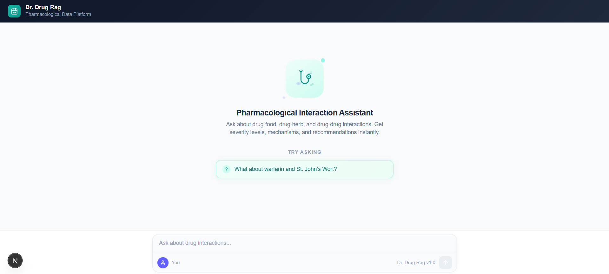
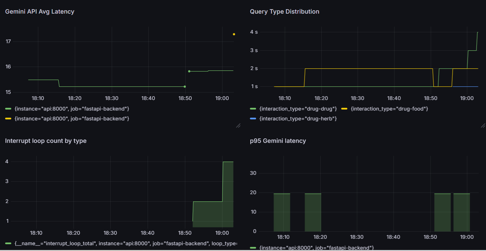

# DrugRAG System

A FastAPI backend that analyses drug-food, drug-herb, and drug-drug interactions through natural language queries. The system uses a LangGraph-powered multi-agent pipeline to extract interaction entities, retrieve structured data from PostgreSQL, and return clinically formatted responses with a Next.js chat interface for querying drug-food, drug-herb, and drug-drug interactions. Users ask natural language questions and receive clinically formatted responses powered by the backend pipeline. 


### Tech Stack

- **Framework:** FastAPI with async architecture, Next.js 14+ (App Router)
- **Agent Pipeline:** LangGraph with Human-in-the-Loop (HITL) via `interrupt()`
- **LLMs:** Google Gemini 2.5 Flash (query analysis and response formatting)
- **Database:** PostgreSQL via Supabase (interaction data + checkpointing)
- **Observability:** LangSmith for tracing
- **Backend Deployment (planned):** Docker → GitHub Actions → Docker Hub → Render
- **Frontend Deployment (planned):** Vercel
- **Language:** TypeScript
- **Styling:** Tailwind CSS


### Features
- Natural language querying for drug-drug, drug-food, and drug-herb interactions
- Agentic AI pipeline built using LangGraph
- Human-in-the-Loop (HITL) workflow for spelling correction and query confirmation
- Structured retrieval from PostgreSQL knowledge base
- Clinically formatted and user-friendly responses
- Query caching for improved performance
- End-to-end deployment with Docker and CI/CD


### System Architecture
- Client Layer (Next.js) – Chat-based interface for user interaction.
- Backend Layer (FastAPI) – API orchestration and agent execution.
- Agentic AI Layer (LangGraph) – Query analysis, retrieval, and response formatting agents.
- Data Layer (PostgreSQL/Supabase) – Interaction knowledge base and checkpoint storage.
Workflow
- User submits a natural language query.
- Query Analyzer Agent extracts drugs, foods, herbs, and interaction type.
If spelling issues are detected, user confirmation is requested.
Retrieval Agent fetches relevant interaction data from PostgreSQL.
Response Formatter Agent generates a clinically structured response.
Final response is displayed in the chat interface.

#### User Interface (Chatbot)



### Repository Structure
```
├── drug_detection_rag_chatbot_frontend/      # React application
├── drug_detection_rag_chatbot_backend/       # FastAPI backend and LangGraph agents
└── README.md
```


### Setup

1. **Clone the repository**

   ```bash
   git clone https://github.com/samsaw777/apdp-project-backend.git
   ```

2. **Copy the environment file and fill in your values**

   ```bash
   cp .env.examples .env
   ```

3. **Run backend with Docker Compose**

   ```bash
   cd drug_detection_rag_chatbot_backend
   docker compose up --build
   ```

   The API will be available at `http://localhost:8000`.

4. **Run backend without Docker**
   ```bash
   python -m venv .venv
   source .venv/bin/activate        # Windows: .venv\Scripts\activate
   pip install -r requirements.txt
   uvicorn main:app --reload --host 0.0.0.0 --port 8000
   ```

5. **Run frontend**

   ```bash
   cd drug_detection_rag_chatbot_frontend
   npm install
   npm run dev
   ```

    The frontend will be available at `http://localhost:3000`.
    
6. **Run via Kubernetes (Minikube) — optional, for orchestration demo**
    ```bash
    minikube start --driver=docker
    minikube docker-env | Invoke-Expression   # PowerShell; use eval $(minikube docker-env) on bash/zsh
    docker build -t drugrag-api:latest .
    kubectl create secret generic drugrag-secrets --from-env-file=.env
    kubectl apply -f k8s-deployment.yaml
    kubectl apply -f k8s-service.yaml
    ```
    **Check status / access the app:**
    ```bash
    kubectl get pods
    kubectl logs deployment/drugrag-api
    minikube service drugrag-api-service --url
    ```
    
    **After changing code, rebuild and redeploy:**
    ```bash
    minikube docker-env | Invoke-Expression
    docker build -t drugrag-api:latest .
    kubectl rollout restart deployment/drugrag-api
    ```

    **Stop everything:**
    ```bash
    minikube stop
    docker compose down
    ```

    **Note:** In this setup, only the API runs inside Kubernetes — Prometheus and Grafana remain in Docker Compose.


### Monitoring & Observability (Prometheus + Grafana)

To gain visibility into the LangGraph agent pipeline's behavior — retry loops, human-in-the-loop interrupts, and LLM latency — the backend is instrumented with Prometheus metrics, visualized via Grafana.

**1. What's tracked**

| Metric | Type | Purpose |
|---|---|---|
| `retry_analyse_total{reason}` | Counter | How often the analyser's self-correction loop fires (e.g. malformed LLM JSON output) |
| `interrupt_loop_total{loop_type}` | Counter | How often each human-in-the-loop interrupt fires (`spelling`, `clarification`, `both`) |
| `interrupt_resume_duration_seconds{loop_type}` | Histogram | Time between an interrupt firing and the user responding |
| `query_type_total{interaction_type}` | Counter | Distribution of interaction types queried (`drug-drug`, `drug-food`, `drug-herb`) |
| `gemini_call_duration_seconds` | Histogram | Latency of Gemini API calls in the formatter node |

**2. Metric definitions**

All Prometheus metric objects are defined once, at module level, in `monitoring/metrics.py`, and imported wherever they're incremented/observed (in the relevant LangGraph node functions under `Agent_Graph/`).

**3. Exposing metrics**

The FastAPI app exposes a `/metrics` endpoint via `prometheus_client`'s ASGI app, mounted in `main.py`:

```python
from prometheus_client import make_asgi_app

metrics_app = make_asgi_app()
app.mount("/metrics", metrics_app)
```

**4. Docker Compose services**

Two services `prometheus` and `grafana` were added to `docker-compose.yml`, alongside the existing `api` service:


**5. Prometheus scrape config** `prometheus.yml` was added to the project root


#### Running it

```bash
docker compose up --build
```

- Backend metrics (raw): `http://localhost:8000/metrics`
- Prometheus UI: `http://localhost:9090` (check **Status → Targets** to confirm the backend scrape target is `UP`)
- Grafana dashboard: `http://localhost:3001` (login: `admin` / `admin`)
  - Add Prometheus as a data source: URL `http://prometheus:9090`
  - Dashboard panels are built via Grafana's **Explore** view or the panel editor, using PromQL queries against the metrics listed above (e.g. `histogram_quantile(0.95, rate(gemini_call_duration_seconds_bucket[5m]))` for p95 Gemini latency)



#### Notes

- Metrics update in real time as requests flow through the pipeline; Prometheus scrapes automatically every 15s — no manual triggering needed.
- This setup currently runs locally via Docker Compose for development/observability purposes and has not yet been adapted for the production deployment target.


### Monitoring LangSmith traces

1. Sign up / log in at [smith.langchain.com](https://smith.langchain.com)
2. Open the project matching `LANGSMITH_PROJECT` (`drugrag_tracking`)
3. Each query sent through the app appears as a trace — expandable into every node the LangGraph pipeline executed, with inputs, outputs, and latency per step