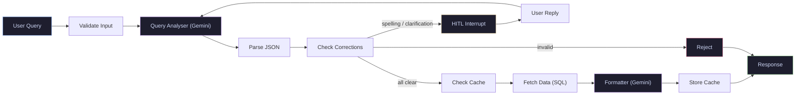

# Backend — DrugRAG API

A FastAPI backend that analyses drug-food, drug-herb, and drug-drug interactions through natural language queries. Uses a LangGraph-powered multi-agent pipeline to extract interaction entities, retrieve structured data from PostgreSQL, and return clinically formatted responses.

> For setup, installation, and running the full project (frontend + backend + monitoring + Kubernetes), see the [root README](../README.md).


#### Architecture





#### API Endpoints

1. #### `POST /api/v1/analyse`
    Analyse a natural language query for drug interactions.

    **Request:**

    ```json
    {
      "raw_query": "Does warfarin interact with grapefruit?"
    }
    ```

    **Response (success):**

    ```json
    {
      "interactions": [
        {
          "type": "drug-food",
          "drug": "warfarin",
          "target": "grapefruit"
        }
      ],
      "clarification_needed": false,
      "clarification_message": "",
      "corrected_query": "Does warfarin interact with grapefruit?",
      "final_output": "### ⚠️ Interaction Found: Warfarin ↔ Grapefruit\n\n**Effect:** ..."
    }
    ```

    **Response (clarification needed):**

    ```json
    {
      "type": "clarification",
      "thread_id": "abc-123",
      "message": "Are you looking for food, herb, or drug interactions with warfarin?",
      "corrections": []
    }
    ```

    **Response (spelling correction):**

    ```json
    {
      "type": "spelling",
      "thread_id": "abc-123",
      "message": "\"asprin\" → did you mean \"aspirin\"? Reply \"yes\" to confirm, or provide the correct name(s).",
      "corrections": [
        { "original": "asprin", "corrected": "aspirin", "type": "drug" }
      ]
    }
    ```

    #### `POST /api/v1/analyse/confirm`

    Resume a paused pipeline after spelling correction or clarification.

    **Request:**

    ```json
    {
      "thread_id": "abc-123",
      "user_reply": "yes"
    }
    ```

    **Response:** Same as `/analyse` — returns either a `QueryResponse`, another `ClarificationResponse` if further input is needed, or an error.

2. #### `GET /api/v1/`

    Health check. 


### Pipeline Flow

1. **Validate Input** — rejects empty queries.
2. **Query Analyser (LLM)** — extracts interaction pairs, detects spelling issues, determines if clarification is needed, validates query relevance.
3. **Parse Response** — parses LLM JSON output, with retry logic (up to 2 retries).
4. **Check Corrections** — routes based on validation result:
   - `is_valid: false` → rejects gibberish/off-topic queries immediately
   - `clarification_needed: true` → triggers HITL interrupt for missing information
   - `spelling_flags` present → triggers HITL interrupt for spelling confirmation
   - All clear → proceeds to data retrieval
5. **HITL Interrupt** — pauses the graph via LangGraph's `interrupt()`, returns clarification/spelling message to user. On resume, applies the user's reply and re-runs the analyser if needed.
6. **Check Cache** — looks up canonical key in cache table; on hit, returns cached response.
7. **Fetch Data (SQL)** — executes parameterised queries against the interaction database using `psycopg`.
8. **Format Output (LLM)** — Gemini formats raw SQL results into structured markdown with severity, mechanism, risks, and recommendations.
9. **Store Cache** — caches the formatted response for future identical queries.
10. **Cleanup** — deletes checkpoint data for the completed thread.

### Environment Variables

| Variable | Required | Description |
|---|---|---|
| `GEMINI_API_KEY` | Yes | Google Gemini API key (analyser) |
| `GEMINI_API_KEY_ONE` | Yes | Google Gemini API key (formatter) |
| `GEMINI_MODEL` | Yes | Gemini model name used by analyser/formatter |
| `DATABASE_URL` | Yes | PostgreSQL connection string (interaction data) |
| `DATABASE_URL_CHECKPOINT` | Yes | PostgreSQL connection string (LangGraph checkpointing) |
| `CORS_ORIGINS` | Yes | Comma-separated allowed origins |
| `LANGSMITH_API_KEY` | No | LangSmith API key for tracing |
| `LANGSMITH_PROJECT` | No | LangSmith project name |
| `LANGSMITH_TRACING` | No | Enable LangSmith tracing (`true`/`false`) |
| `LANGSMITH_ENDPOINT` | No | LangSmith endpoint URL |


## Testing

```bash
pytest
```

<!-- ## Deployment

The project uses GitHub Actions for CI/CD:

1. Push to `main` triggers the workflow.
2. Docker image is built and pushed to Docker Hub.
3. Render pulls the latest image and deploys.

The frontend (Next.js) is deployed separately on Vercel. -->


## Project Structure

```
├── Agent_Graph/
│   └── analyser_graph.py        # LangGraph state machine definition
├── Agent_Nodes/
│   └── query_nodes.py           # All graph node functions
├── Agent_Prompts/
│   └── analyser_prompt.py       # LLM prompt templates
├── Agents/
│   ├── query_analyser.py        # Agent wrapper (analyse, confirm, cleanup)
│   ├── basic_agent.py           # Test agent
│   └── formatter_agent.py       # Response formatter
├── Agents_State/
│   └── Query_state.py           # TypedDict state definition
├── config/
│   ├── settings.py              # Pydantic settings (env vars)
│   └── llm.py                   # LLM client factory
├── routes/
│   ├── analyze_query_route.py   # /analyse and /analyse/confirm endpoints
│   ├── health.py                # Health check
│   └── main_route.py            # Root route
├── schemas/
│   └── analyse_query.py         # Pydantic models (QueryRequest, QueryResponse, etc.)
├── utils/
│   ├── cache.py                 # Response caching logic
│   ├── db_checkpoint.py         # AsyncPostgresSaver setup
│   ├── db_main.py               # Main database connection pool
│   └── sql_builder.py           # Parameterised query builder
├── tests/
│   ├── test_node.py             # Node unit tests
│   └── test_schemas.py          # Schema validation tests
├── services/
│   └── analyser.py              # Service layer
├── main.py                      # FastAPI app entry point
├── Dockerfile
├── docker-compose.yaml
├── requirements.txt
└── .github/workflows/
    └── dockerhub.yml            # CI/CD pipeline
```